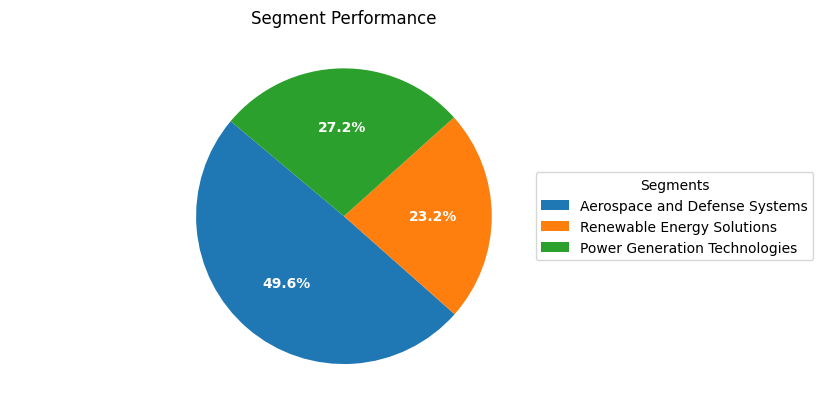

# GE primer

**"Global industrial leader specializing in energy, aerospace, and digital innovation."**

## Overview
- General Electric Company (GE) is a diversified multinational corporation, primarily engaged in power generation, renewable energy, healthcare, and aerospace, with a commitment to sustainable development and innovation. GE generates revenue through the sale of complex industrial products like jet engines and wind turbines, complemented by long-term service agreements, serving a vast customer base across over 160 countries, including governments and major industries. Its business model focuses on technological advancement, lean manufacturing, and maintaining a competitive edge through innovation, while managing risks associated with geopolitical tensions, regulations, and cybersecurity. The company continually invests in research and development and fosters a culture of diversity, inclusion, and sustainability, essential to its long-term success and strategic objectives. GE is also navigating structural transformations with plans to separate into independent entities, GE Aerospace and GE Vernova, to sharpen focus on its business segments and financial performance.
## Financials
| Metric($ million) | 2021   | 2022   | 2023   |
|-------------------|--------|--------|--------|
| Revenue         | 74.196 | 67.328 | 68.0 |
| *Revenue's % yoy* | 3.163% | 3.18% | 17.1% |
| Gross Profit         | 21.02 | 17.517 | 42.0 |
| *Gross Profit's % margin* | 27.6% | 27.213% | 61.8% |
| Operating Profit         | 5.277 | 3.8 | 10.2 |
| *Operating Profit's % margin* | 8.133% | 6.5% | 15.0% |
| Net Profit         | -6.757 | 0.118 | 9.4 |
| *Net Profit's % margin* | -9.1% | 0.21% | 13.9% |

## Segment Performance

